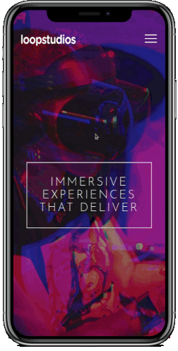

<h1 align="center">Loopstudios</h1>
<p align="center">
     A responsive static page with knowledge of HTML and CSS applied in its construction. 
</p> 

<p align="center">
    
</p>

<div align="center">
    
    
      
</div>

## 🚀 Technologies
* ✔️ HTML
* ✔️ CSS/SASS/SCSS

## ℹ️ How To Use
To use this project, you will need [Node](https://nodejs.org/en/) and [GIT](https://git-scm.com/) installed on your computer.

With these tools in hand, follow the steps below
```
# Clone this repository
$ git clone https://github.com/vitormrts/loopstudios-landing-page

# Go to the repository cloned
$ cd loopstudios-landing-page

# Install live-server
$ npx live-server
```

Done! Now you have this application in your computer.

## 📝 License
This project is under the MIT license. See the [LICENSE](https://github.com/vitormrts/loopstudios-landing-page/blob/master/LICENSE) file for more details.

---

<p align="center">Feito com ❤️ por <strong>Vitor Martins ✌ </p>


